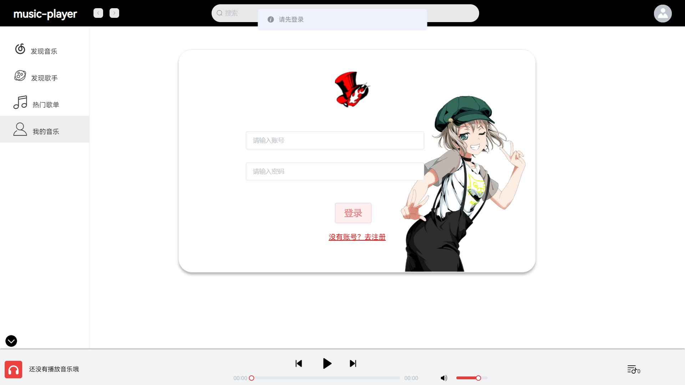
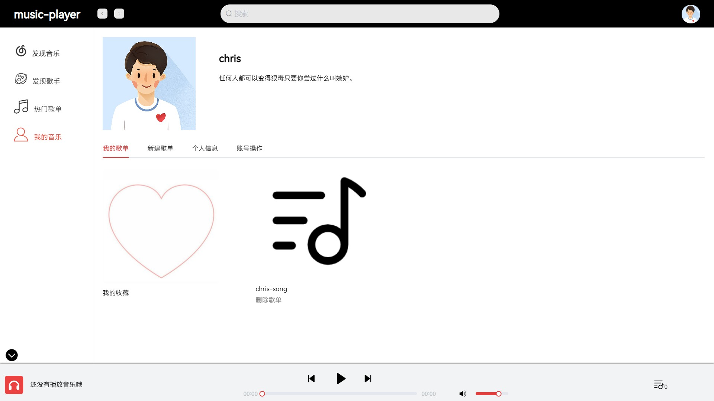
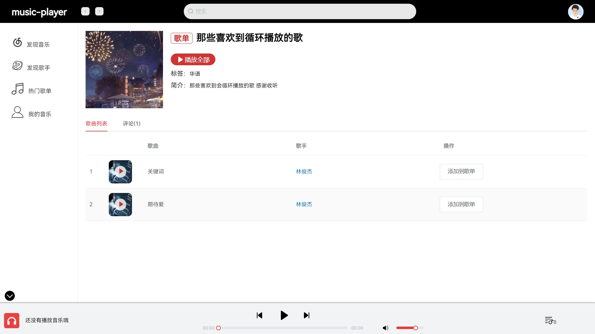
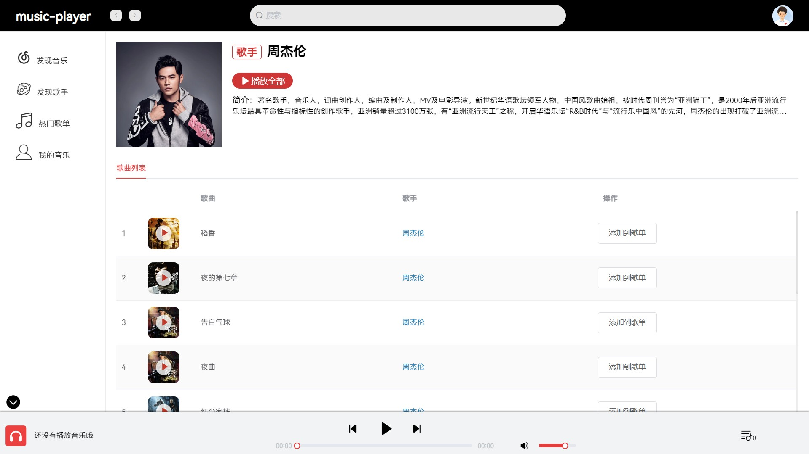

> 这是我们软工小组的音乐播放网站的用户前台项目，完整的项目见[music-player](https://github.com/abel-chai/music-player)。

# 运行

```bash
npm install
npm run serve
```

# 功能介绍

1. 首先进入项目首页，展示推荐歌曲和推荐歌单（首页仿照网易云音乐iPad端的界面）

   

2. 推荐界面分别有歌单推荐和歌曲推荐，两个界面的样式都差不多

   

   

3. 点击我的界面，如果没有登录，会跳转到登录页面；如果登录了，就显示用户页面，执行一系列操作。包括的操作有：

   1. 展示个人的资料、收藏的歌曲和创建的歌单。
   2. 输入歌单名和歌单描述创建用户歌单
   3. 修改个人的信息，在前端使用正则表达式进行输入格式的限制。
   4. 修改密码和注销账号

   > 退出登录点击右上角的头像即可

   

   

4. 点击歌单和歌手分别进入相应的页面，其中歌单页面可以评论

   

   

5. 可以按歌名或歌单名进行搜索，后端是模糊查询

   

6. 播放器界面如下，仿照网易云音乐

   

# 细节处理

编写代码的时候有很多细节没有注意，后面小组测试的时候发现了很多：

1. 操作成功和失败都应该给用户反馈，且页面最好要及时刷新。如果什么反馈都没有用户体验很差。
2. 用户提交的输入（如手机号、邮箱等）应该进行检测，一般使用正则匹配，判断是否合法。
3. 用户不同的操作失误应该给出不同的提示，如输入为空应该提示“输入不能为空”，输入的格式不对应该提示“xxx格式错误”。笼统地提示一个error是不好的。
4. 表单输入后最好不要把之前输入的数据留下来，不然下次输入的时候用户要一个个删，很麻烦。可以采用措施是表单提交时绑定的数据置为空，或下次表单focus时把它绑定的数据清空。
5. 注册或修改密码这些地方应该进行二次确定。
6. 一些比较敏感的操作，应该添加提示框来确定用户是否要进行该操作，如删除歌单、清空播放列表、注销账号等；而不那么敏感的操作就不用，如删除歌单中的一首歌、用户修改信息等，不然会让用户觉得很繁琐。

# log

1. ~~列表添加操作~~
2. ~~没有登录添加到歌单和评论(登录后不输入)的提示~~
3. ~~点击歌手跳转到歌手页面~~
4. ~~音乐标题-》歌曲~~
5. ~~评论用户取消超链接~~
6. 最新音乐调整（*)
7. ~~发现歌手和热门歌单=》歌单推荐顶部推荐修改~~
8. ~~歌手图片大小~~
9. log删掉
10. 系统名
11. ~~没有登录的时候点击我的音乐或头像提示登录~~
12. ~~注册失败提示~~
13. ~~注册成功提示~~
14. ~~登录失败提示~~
15. 用户名限制：正则表达式（*）
16. ~~我的收藏图片修改~~
17. ~~用户新建歌单style值为用户~~
18. ~~个人信息页面 签名和电话的图标修改~~
19. ~~退出登录按钮位置~~
20. ~~个人信息修改 点击修改时putInfo赋值~~
21. ~~用户歌单的取消收藏~~
22. ~~删除歌单刷新~~
23. ~~搜索框确定之后清空~~
24. ~~搜索歌单时歌单图片显示错误~~
25. ~~底部播放器可收放~~

> 另外，我们到最后还是没有想出一个像样的系统名，所以只有叫music-player了😥

# 最后

因为我是第一次正经地写前端，能力有限，要实现一些比较复杂的功能还是有点困难，如播放器界面等，所以参考了很多项目。一并感谢。

1. [Music_Player](https://github.com/MrRainbowYoo/Music_Player)
2. [vue-netease-music](https://github.com/sl1673495/vue-netease-music)
3. [vue3-music](https://github.com/SmallRuralDog/vue3-music)
4. [Simple-music-player](https://github.com/XiangZi7/Simple-music-player)